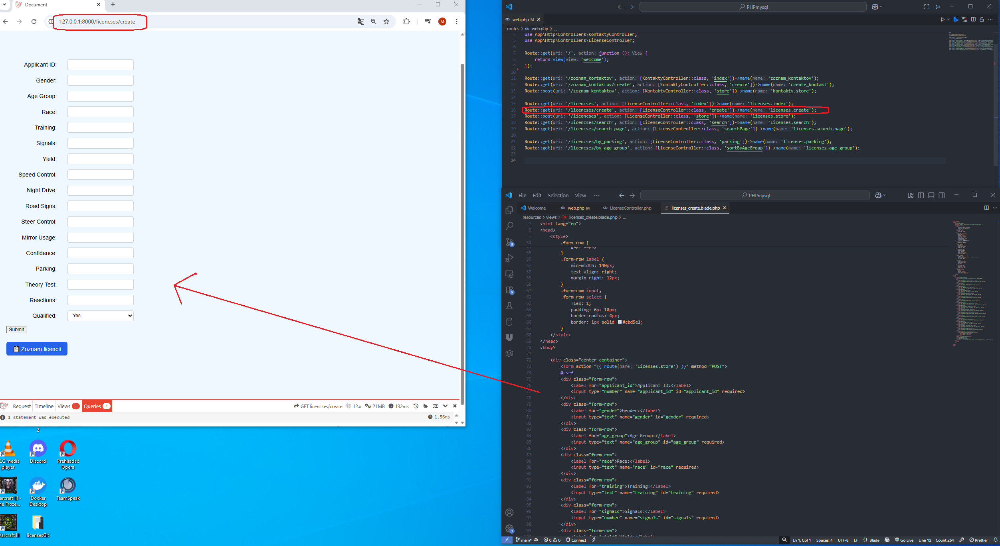
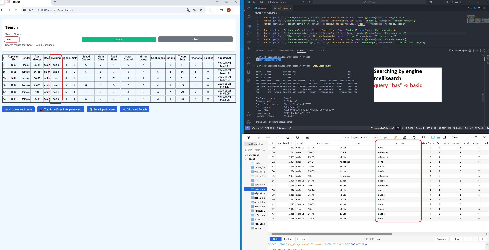
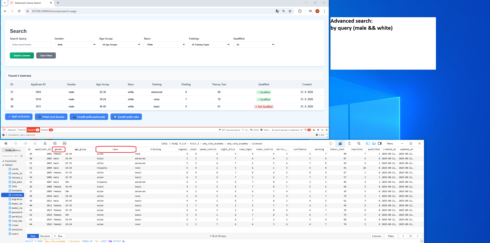
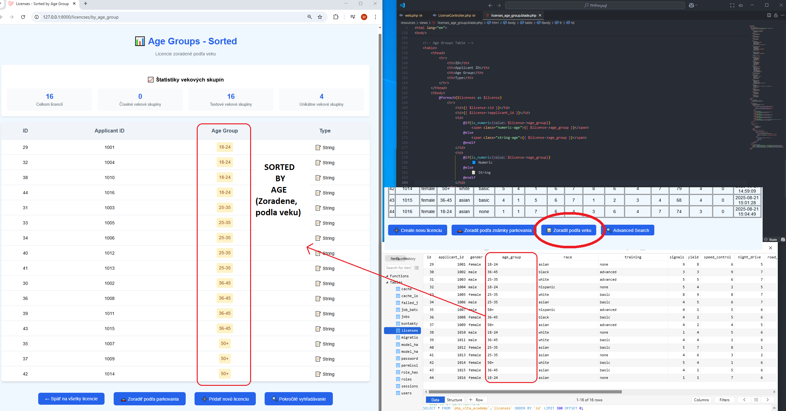
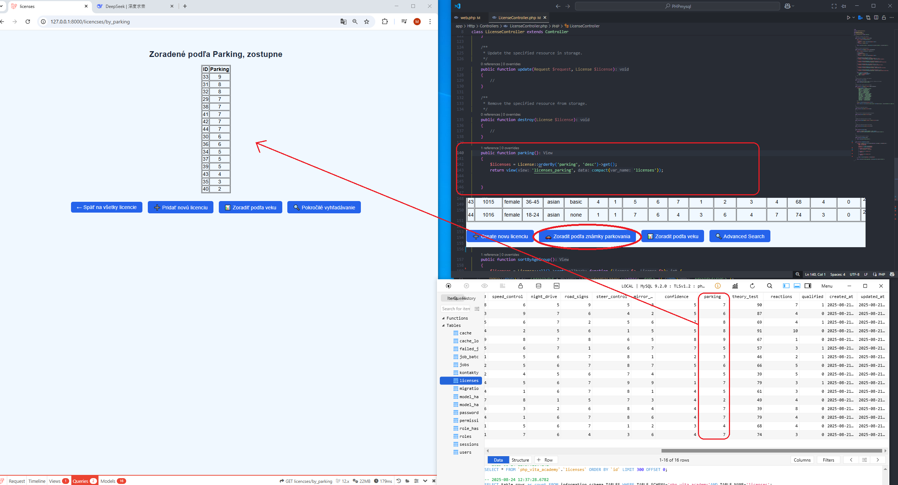
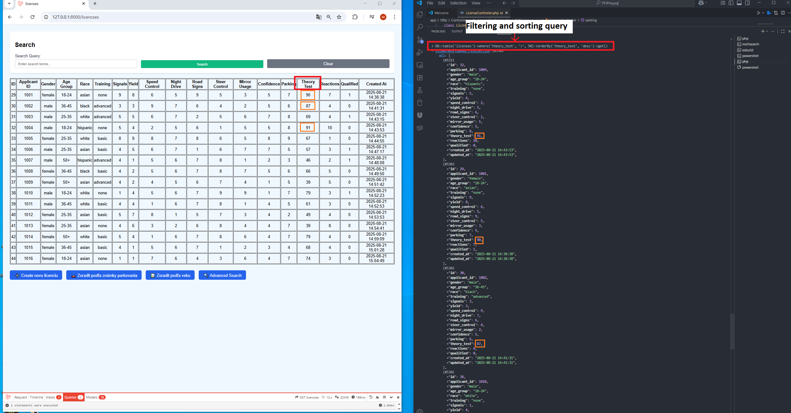

<b> Abstrakt: </b><br>
Užívateľ si vyplní formulár, ktorý sa uloží do databázy licencií. V projekte sú dve funkcie, funkcia parkovania DESC(zostupne) a zoradenie poďla veku ASC(vzostupne). Pomocou týchto funkcií si uživaťeľ, vie vyfiltrovať a zobraziť príslušne údaje. V tomto projekte je tiež implementovaný meilisearch, ktorý slúži ako vyhľadavač, kľučových slov, ktoré zadá uživateľ. Takisto je tu aj advanced search, uživaťel si pomocou šablony a kritérií, sám vyfiltruje potrebné údaje z databázy. Nakoniec je ukážka, ako pomocou artisan konzoly, cez query builder filtrujú dáta z databázy.</br><br>

- 🔍  search with Meilisearch 
- 📊 groups analysis 
- 🅿️ **Parking license filtering** 
- 📈 **Theory test score tracking** and filtering
- 🎯 Advanced filtering by multiple criteria
  
<h1>📸 License Interface</h1>


<h1>📸 Create new record in database</h1>


 <h1>📸 Meilisearch by query "bas"</h1>


 <h1>📸 Advanced Search by criteria</h1>


<h1>📸 Age Group Analysis, Sorting by function</h1>


<h1>📸 Parking License Filtering by function</h1>


<h1>📸 Laravel Artisan Tinker - Database Queries by criteria</h1>


###  Filtering
```php
//  filtering with query builder
DB::table('licenses')
    ->where('theory_test', '>', 50)
    ->orderBy('theory_test', 'desc')
    ->get();
```
 


