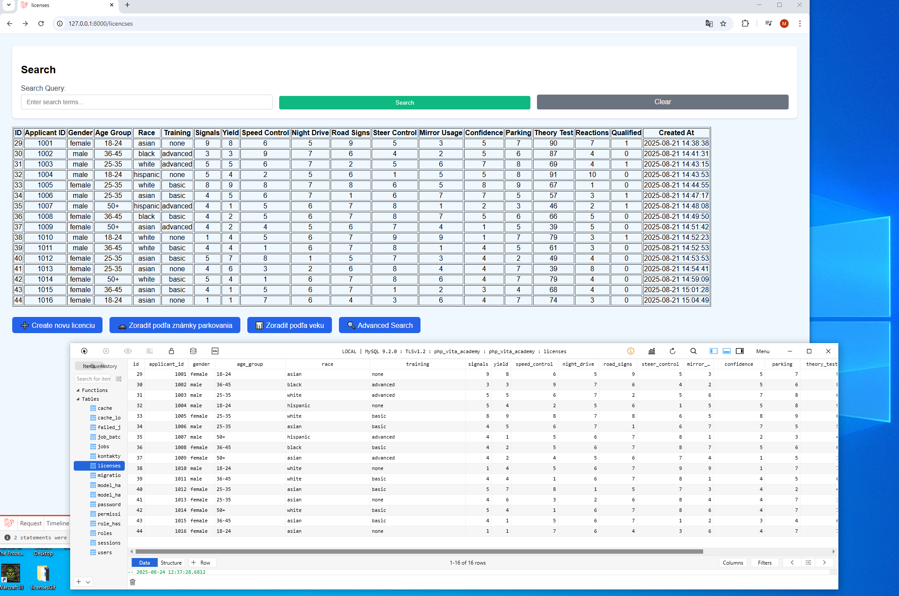

 Abstrakt:
MVC project, Implementácia komplexného filtrovania a vyhľadávania.
Použité technológie a postupy:
Eloquent ORM pre databázové operácie, Laravel Scout integrovaný s Meilisearch pre okamžité full-textové vyhľadávanie, Tvorba RESTful API so štruktúrovanými JSON odpoveďami

 Absract:
Demonstrates development abilities suitable for license management, or any system requiring complex data filtering, search functionality, and MVC web application architecture.
Using Eloquent ORM for database operations, Laravel Scout integration with Meilisearch for instant full-text search capabilities, and RESTful API development returning structured JSON responses.
 

  
- 🔍  search with Meilisearch 
- 📊 groups analysis 
- 🅿️ **Parking license filtering** 
- 📈 **Theory test score tracking** and filtering
- 🎯 Advanced filtering by multiple criteria


<h1>📸 License Interface</h1>


<h1>📸 Create new record in database</h1>


 <h1>📸 Meilisearch by query "bas"</h1>


 <h1>📸 Advanced Search by criteria</h1>


<h1>📸 Age Group Analysis, Sorting by function</h1>


<h1>📸 Parking License Filtering by function</h1>


<h1>📸 Laravel Artisan Tinker - Database Queries by criteria</h1>


###  Filtering
```php
//  filtering with query builder
DB::table('licenses')
    ->where('theory_test', '>', 50)
    ->orderBy('theory_test', 'desc')
    ->get();
```
 


